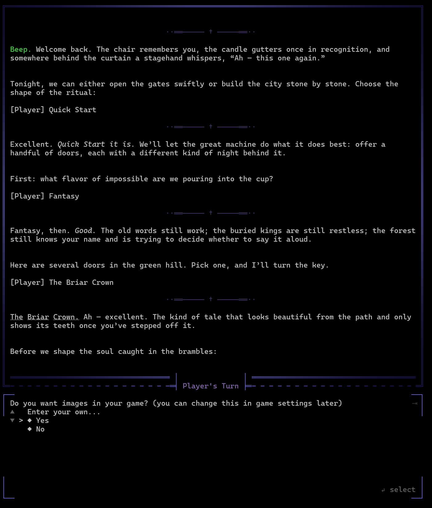
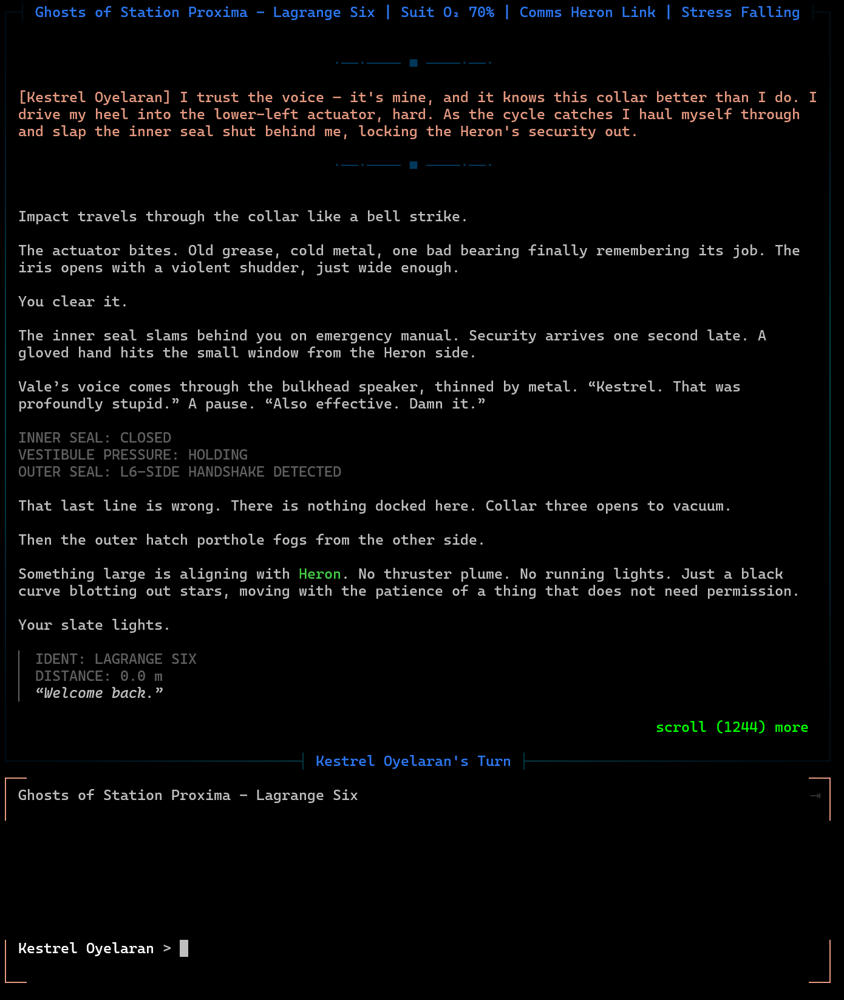
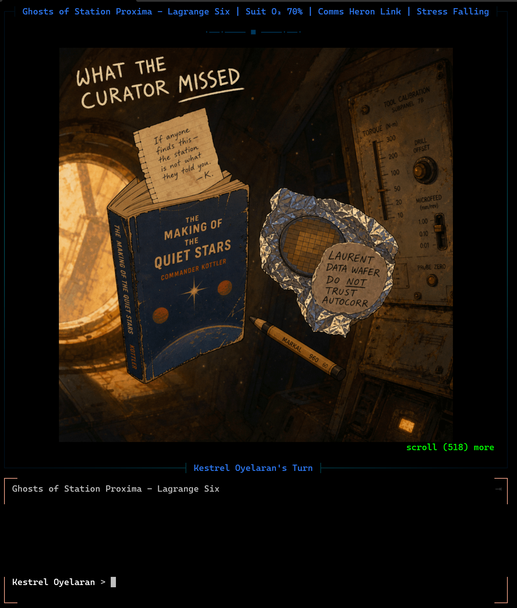

# Machine Violet

[](https://discord.gg/dDbGZrecvX)
[](https://github.com/octopollux/machine-violet/actions/workflows/ci.yml)
[](https://github.com/octopollux/machine-violet/actions/workflows/nightly.yml)

| | | |
|:-:|:-:|:-:|
|  |  |  |

Machine Violet is an agentic AI storytelling/roleplay engine that runs in your terminal.

## What it does

- **Build your story.** Interactively build a narrative with a friendly game setup agent, and then explore it with the help of a powerful AI storyteller.
- **Create a compendium.** Characters, locations, objectives, factions, and lore are compiled into a library for you and keep the story alive.
- **Rich support for game mechanics.** Full support for dice, decks, RPG rules, and more as agentic tools. 

## Install

You'll need an [Anthropic API key](https://console.anthropic.com/) — add it from the main menu on first launch.

**Windows**:
Download the [**nightly release**](https://github.com/octopollux/machine-violet/releases/tag/nightly) and unzip, then run **MachineViolet.exe**.

**Homebrew** (macOS / Linux):
```bash
brew install octopollux/mv-tap/machine-violet
```

**macOS / Linux** (manual):
```bash
curl -fsSL https://raw.githubusercontent.com/octopollux/machine-violet/main/scripts/install.sh | bash
```
Then run `machine-violet` in your terminal. 

## Development

```bash
npm install
npm run dev                    # launch (needs ANTHROPIC_API_KEY in .env)
npm run check                  # lint + tests
npm run dist                   # build standalone binary
```

See [CLAUDE.md](CLAUDE.md) for architecture, conventions, and contribution guidelines. Full documentation lives in [docs/](docs/index.md).

## AI Models
Machine Violet is based on the Claude API, and requires an **Anthropic API key**.

The main storyteller runs on Claude Opus; mechanical subagents run on Sonnet and Haiku.

## License

MIT
